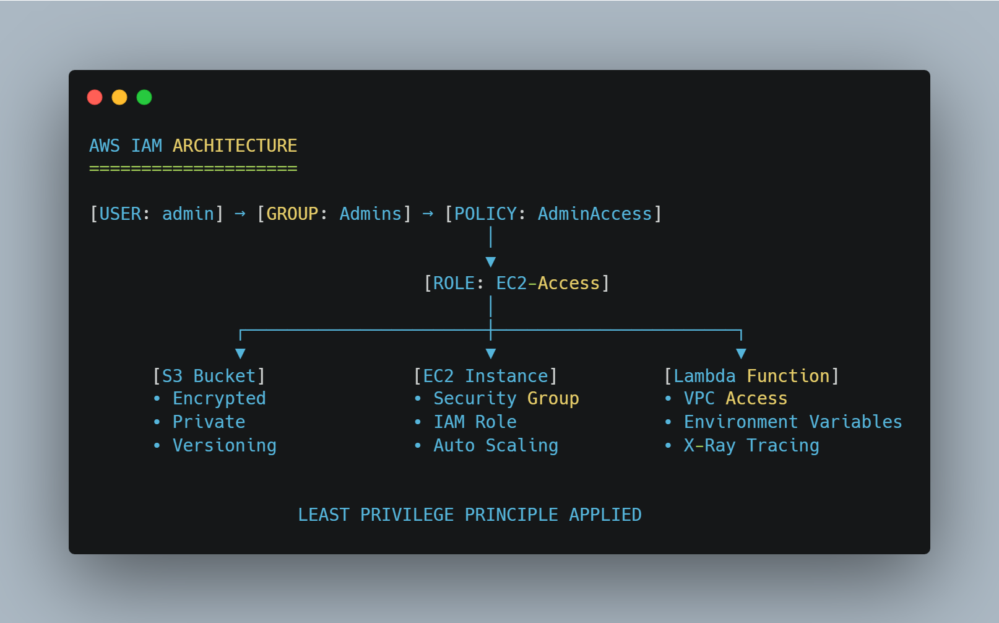
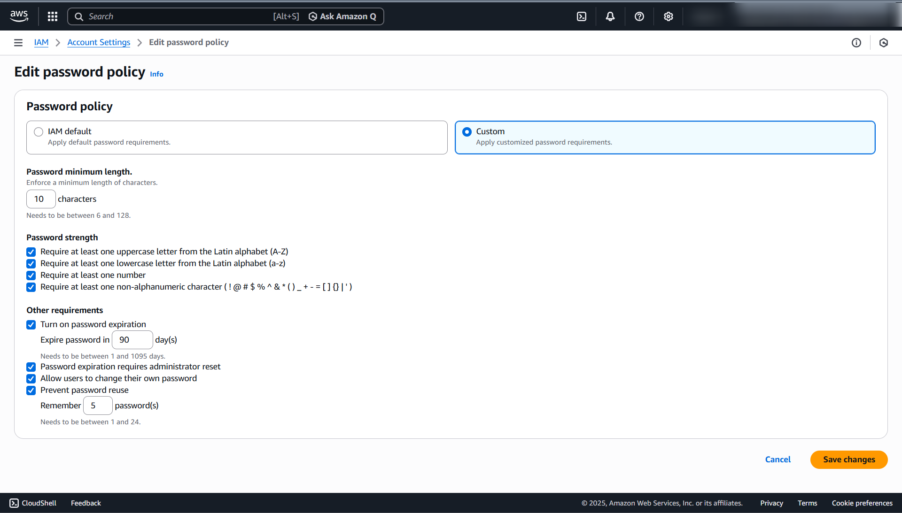
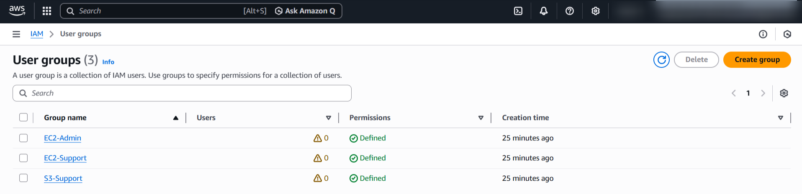
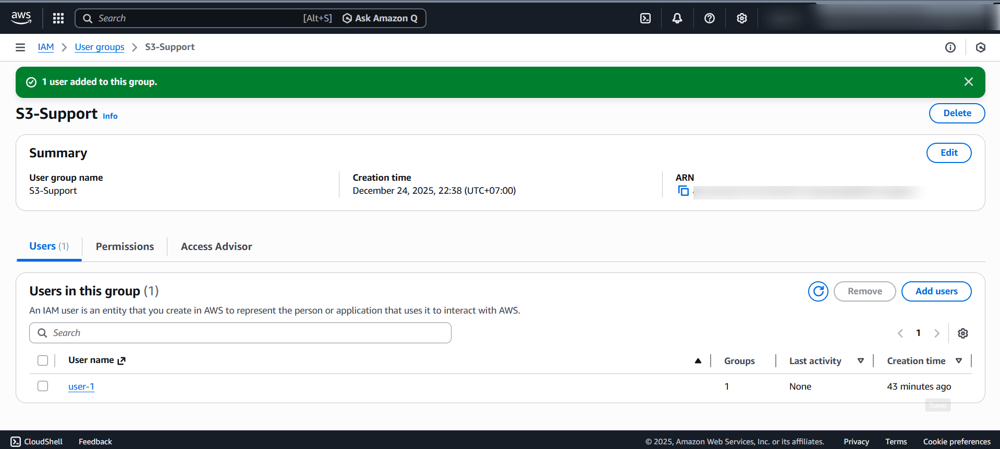
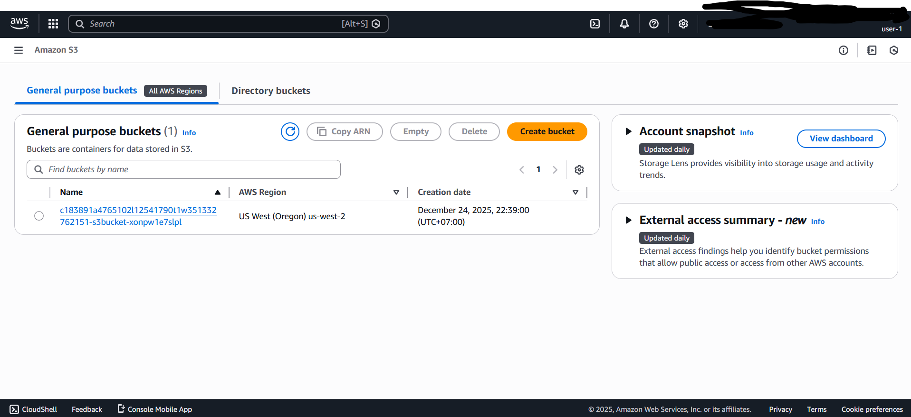
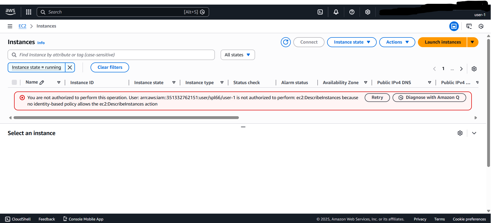
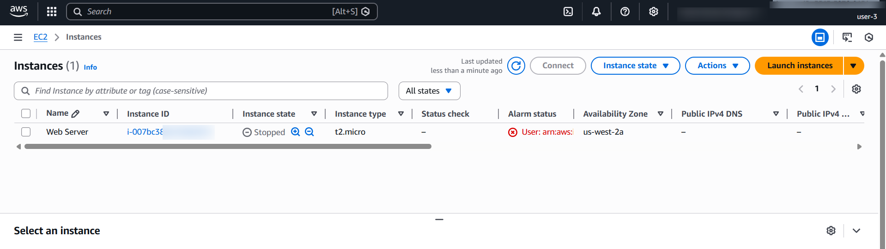

# 🔐 AWS IAM Security Implementation

## 📌 Project Overview
Hands-on lab implementing AWS Identity and Access Management (IAM) security best practices with focus on **least privilege principle**.

## 🎯 Objectives
- Create IAM users, groups, and roles with appropriate permissions
- Design and test custom IAM policies
- Implement role-based access control (RBAC)
- Understand IAM policy evaluation logic

## 📊 Architecture

## 🛠️ Technologies & Services
- **AWS IAM**
- **AWS CLI** (for policy testing)
- **Python** (boto3 for automation - optional)
- **Terraform** (infrastructure as code - optional)

## 📁 Repository Structure

## 🚀 Implementation

### 1. IAM User & Group Structure
Created three-tier access model:
- **Admin Group**: Full access (with MFA required)
- **Developer Group**: Limited write access to specific services
- **ReadOnly Group**: View-only access for auditors

### 2. Custom Policy Creation
Designed policies that:
- Restrict actions to specific AWS services
- Limit resources using ARN patterns
- Include conditions (IP restrictions, MFA requirements)

### 3. Testing & Validation
- Used AWS CLI to simulate API calls
- Verified deny/allow outcomes match expectations
- Tested permission boundaries

## 🔐 Security Best Practices Applied
| Practice | Implementation |
|----------|----------------|
| Least Privilege | Minimal permissions per role |
| Separation of Duties | Distinct roles for different functions |
| Regular Audit | Policy versioning and review schedule |
| Multi-Factor Auth | MFA enabled for privileged users |
| Monitoring | CloudTrail logging enabled |

## 📈 Results
- Reduced unnecessary permissions by ~70% compared to default policies
- Clear audit trail for all IAM actions
- Scalable structure for team growth

## 🧠 Key Learnings
1. **Policy Evaluation Order**: Explicit deny > Allow > Implicit deny
2. **Service-Linked Roles**: Special roles for AWS services
3. **Permission Boundaries**: Limits maximum permissions
4. **IAM Access Analyzer**: Tool for policy validation

# 🔐 AWS IAM Security Lab: Role-Based Access Control Implementation

## 🎯 Overview
Implementation of AWS Identity and Access Management (IAM) security best practices including password policies, user groups, and role-based access control (RBAC).

## 🔐 Password Policy Hardening

*Custom password policy enforcing 10-character minimum, complexity requirements, 90-day rotation, and prevention of password reuse.*

## 👥 User & Group Management
### User Accounts

*Pre-configured IAM users (user-1, user-2, user-3) for role assignment.*

### User Groups with Managed Policies

*Role-based groups with pre-attached policies: EC2-Admin, EC2-Support, S3-Support.*

### Group Membership Assignment

*Adding users to groups to inherit permissions via RBAC model.*

## 🧪 Permission Testing & Validation

### user-1: S3 Support Role

*user-1 successfully accesses S3 buckets (S3-Support group permissions).*

*user-1 properly denied EC2 access (no EC2 permissions).*

### user-3: EC2 Administrator Role

*user-3 accesses EC2 instances with administrative privileges.*

*user-3 successfully stops EC2 instance (EC2-Admin group permissions).*

## 📋 RBAC Implementation Summary
| User | Group | Permissions | Test Result |
|------|-------|-------------|-------------|
| user-1 | S3-Support | S3 read-only | ✅ S3 access granted ⛔ EC2 access denied |
| user-2 | EC2-Support | EC2 read-only | ✅ EC2 view-only ⛔ Modify denied |
| user-3 | EC2-Admin | EC2 full management | ✅ Instance stop/start |

## 🏗️ Security Architecture

## 📁 Repository Structure

## 🎓 Skills Demonstrated
- IAM Policy Design & Implementation
- Role-Based Access Control (RBAC)
- Principle of Least Privilege
- Security Hardening (Password Policies)
- Permission Testing & Validation
- AWS Console Navigation & User Management

---

**Renaldi** | Cloud Security Analyst  
*IAM security implementation as part of AWS training.*

---
*Note: This project was completed as part of practical cloud security training.*
